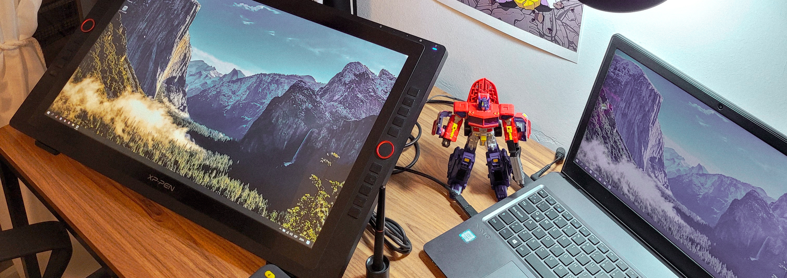

  

###

<h1 align="left">Hola! 👋 Qué tal? || Hey 👋 What's up?</h1>

###

<h2 align="left">Sobre mi  ||  About me</h2>

###

Mi nombre es Matías y me encuentro cursando el primer año de la Tecnicatura Superior en Desarrollo de Software. Estoy aprendiendo lo referente a lenguajes de programación y adentrándome en este mundo.   My name is Matías and I am currently studying the first year of the Higher Technician in Software Development. I'm learning about programming languages ​​and delving into this world.

###

🎲 Fun fact:  Me gusta correr... Mi hobby favorito es dibujar, te invito a ver mi <a href="https://www.artstation.com/matias84">portfolio</a>.

###

<h2 align="left">Lenguajes que estoy aprendiendo || Languages ​​I'm learning:</h2>

###

  
  
  
  
  
  
  

###

<h2 align="left">Herramientas que estoy aprendiendo || Tools I'm learning:</h2>

###

  
  
  

###

<h2 align="left">Programas que utilizo || Programs I use:</h2>

###

  
  
  

###
