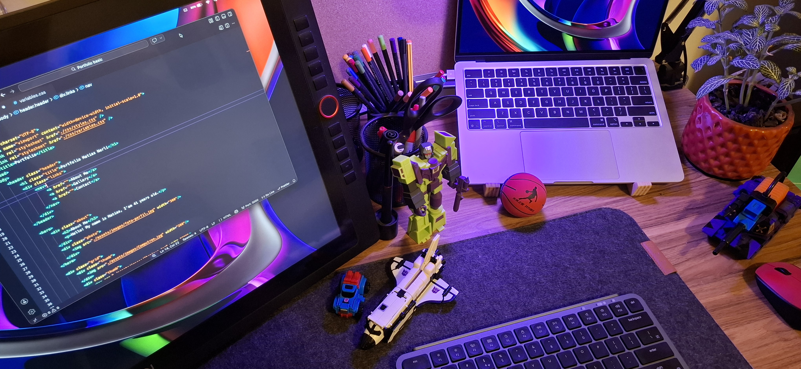

  

###

<h1 align="left">Hi there, I'm Matías 👋</h1>

###

<h2 align="left">About me</h2>

###

Second-year Software Development student passionate about programming and technology.

### 

Focused on improving my web development skills and continuously learning new technologies.

###

  👟 I enjoy running and challenging myself with long-distance races.  
  ✏️ My favorite hobby is drawing — especially comics and digital   art. Check out my <a href="https://www.artstation.com/matias84">portfolio</a>.
   
  📷 Getting into photography.

###

<h2 align="left">Soft skills:</h2>

  <ul>
    <li>Team Leadership</li>
    <li>Problem solving</li>
    <li>Comunication</li>
    <li>Decision Making</li>
    <li>Responsability</li>
    <li>Adaptability</li>
  </ul>

###

<h2 align="left">Languages I'm learning:</h2>

  
  
  
  
  
   

###

<h2 align="left">Tools:</h2>

  
  
  
  

###

<h2 align="left">Software I use:</h2>

  
  
     

###
